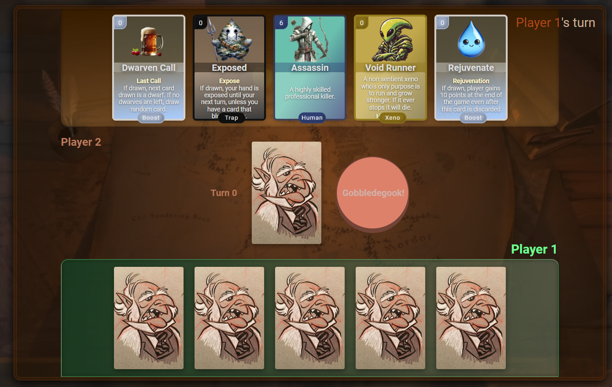

# Gobbledegook
### A fantasy card game.



<br>
<br>

**What is Gobbledegook?**

Gobbledegook is a 2 player card game where players need to collect 5 cards of the same race to win. The rules are nowhere near that simple though, since the main goal is simply to have more points at the end of the game. The game ends whenever one player calls "Gobbledegook"(_hereafter GDG_) by clicking the GDG button in the middle of the board. Different races have different strengths and risks with the Goblins being the most rewarding. The game is currently played on a LAN network, meaning people can play on any device they want (although designed for large screens) as long as they are on the same network. I have no plans on releasing this game to the general public because I do not own a lot of the card art, so it is more of a project intended for me to play with my friends privately. At the time of writing this, there are 6 races; Goblins, Humans, Elves, Dwarves, Beasts and Bots (_with aliens possibly making an appearance one day_).

<br>

**What's the gameplay like?**

Each user takes a turn by first drawing a card and then discarding a card. If the player thinks they have more points than their opponent, they may press the GDG button on their turn, but only after 3 turns to avoid an instant GDG click on a lucky hand. Once the gobbledegook has been declared, the opponent has 1 more turn before the results are announced. It should also be noted that each deck has a leader which significantly buffs their race, players should aim to have at least one leader before calling Gobbledegook.


<br>

**What about mobile?**

This game is currently not released to the general public and is not optimized for mobile. However, the game can be played on a phone it just looks ugly, I do plan on refining a mobile version but it's lower down on the list of priorities.

<br>

**Contact info**

If you want to contact me to discuss a PR or a bug or simply some ideas, you can email me using braithwaite.de@gmail.com.

<br>

**P.S.** I always appreciate those who take the time to read these, since I rarely take the time to type them! Thanks for popping in, stay awesome 😎.

<br>
<br>
___

# Svelte + TS + Vite

This template should help get you started developing with Svelte and TypeScript in Vite.

## Recommended IDE Setup

[VS Code](https://code.visualstudio.com/) + [Svelte](https://marketplace.visualstudio.com/items?itemName=svelte.svelte-vscode).

## Need an official Svelte framework?

Check out [SvelteKit](https://github.com/sveltejs/kit#readme), which is also powered by Vite. Deploy anywhere with its serverless-first approach and adapt to various platforms, with out of the box support for TypeScript, SCSS, and Less, and easily-added support for mdsvex, GraphQL, PostCSS, Tailwind CSS, and more.

## Technical considerations

**Why use this over SvelteKit?**

- It brings its own routing solution which might not be preferable for some users.
- It is first and foremost a framework that just happens to use Vite under the hood, not a Vite app.

This template contains as little as possible to get started with Vite + TypeScript + Svelte, while taking into account the developer experience with regards to HMR and intellisense. It demonstrates capabilities on par with the other `create-vite` templates and is a good starting point for beginners dipping their toes into a Vite + Svelte project.

Should you later need the extended capabilities and extensibility provided by SvelteKit, the template has been structured similarly to SvelteKit so that it is easy to migrate.

**Why `global.d.ts` instead of `compilerOptions.types` inside `jsconfig.json` or `tsconfig.json`?**

Setting `compilerOptions.types` shuts out all other types not explicitly listed in the configuration. Using triple-slash references keeps the default TypeScript setting of accepting type information from the entire workspace, while also adding `svelte` and `vite/client` type information.

**Why include `.vscode/extensions.json`?**

Other templates indirectly recommend extensions via the README, but this file allows VS Code to prompt the user to install the recommended extension upon opening the project.

**Why enable `allowJs` in the TS template?**

While `allowJs: false` would indeed prevent the use of `.js` files in the project, it does not prevent the use of JavaScript syntax in `.svelte` files. In addition, it would force `checkJs: false`, bringing the worst of both worlds: not being able to guarantee the entire codebase is TypeScript, and also having worse typechecking for the existing JavaScript. In addition, there are valid use cases in which a mixed codebase may be relevant.

**Why is HMR not preserving my local component state?**

HMR state preservation comes with a number of gotchas! It has been disabled by default in both `svelte-hmr` and `@sveltejs/vite-plugin-svelte` due to its often surprising behavior. You can read the details [here](https://github.com/rixo/svelte-hmr#svelte-hmr).

If you have state that's important to retain within a component, consider creating an external store which would not be replaced by HMR.

```ts
// store.ts
// An extremely simple external store
import { writable } from 'svelte/store'
export default writable(0)
```
